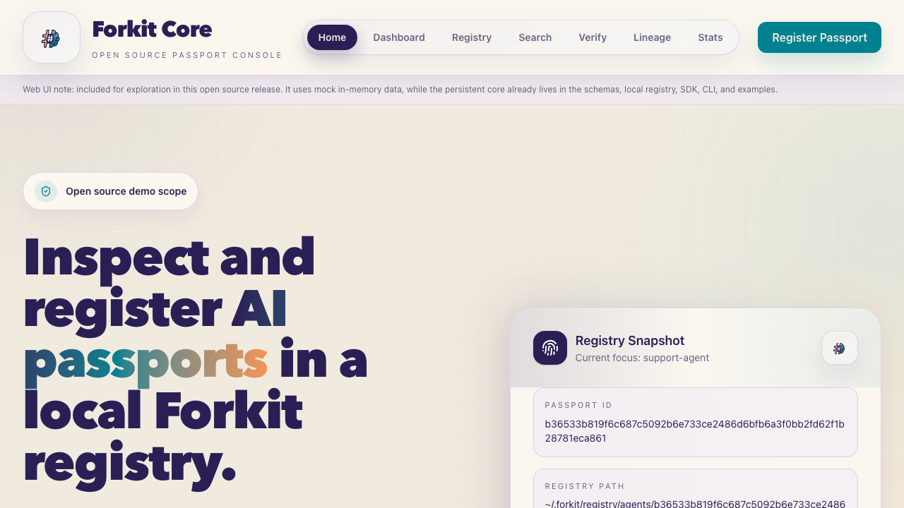
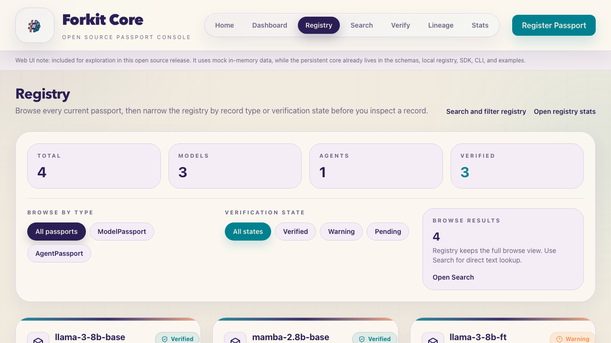
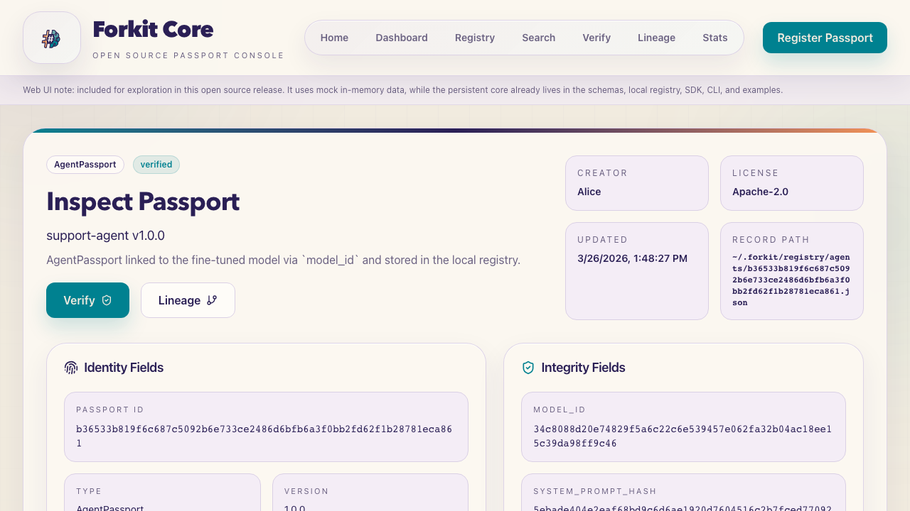

# Forkit Dev Core (Passport for Models and Agents)

> Identity and provenance infrastructure for AI models and agents.

[](#install)
[](#install)
[](#install)
[](LICENSE)

`forkit-core` gives every AI model and agent a **cryptographically-identified passport** — a structured, versioned, verifiable record of what it is, where it came from, and what it is authorised to do.

Zero hard dependencies. Works offline. Deterministic IDs.

Forkit Core stays local and file-based, with developer-friendly compatibility tools for GitHub CI passport validation and Hugging Face model card export.

---

## Start Here

Recommended first runs:

- SDK core flow: [`examples/sdk_quickstart.py`](./examples/sdk_quickstart.py)
- LangGraph registration + sync: [`examples/langgraph_sync_quickstart.py`](./examples/langgraph_sync_quickstart.py)
- LangChain registration + sync: [`examples/langchain_sync_quickstart.py`](./examples/langchain_sync_quickstart.py)
- Generic self-host sync: [`examples/self_host_sync_quickstart.py`](./examples/self_host_sync_quickstart.py)

If you are evaluating Forkit for framework adoption, start with LangGraph or
LangChain first. They show the current adapter pattern that can later be
extended to other ecosystems.

---

## OSS Scope

This repository is the open-source, local-first core of Forkit.

Included in OSS:

- passport schemas and deterministic `passport_id` derivation
- artifact hashing, integrity verification, and lineage
- local JSON + SQLite registry
- local HTTP service for registration, lookup, verification, lineage, and export
- generic sync built on `GET /export`, `POST /sync/passports`, `sync push`, and `sync pull`
- LangGraph and LangChain adapters
- self-host and local development examples

Contribution rules:

1. Keep `passport_id` deterministic and local.
2. Keep systems connected through documents and HTTP contracts, not shared databases.
3. Keep OSS useful offline and without any hosted dependency.
4. Keep remote metadata separate from passport identity.
5. Keep this repository focused on portable passports, verification, and integration adapters.

---

## What's inside

| Module | Purpose |
|---|---|
| `forkit.domain` | Identity derivation, SHA-256 hashing, DAG lineage, integrity verification |
| `forkit.schemas` | `ModelPassport` and `AgentPassport` — dataclass backend (default) or Pydantic v2 (optional) |
| `forkit.registry` | Local filesystem store (JSON files + SQLite index) |
| `forkit.sdk` | `ForkitClient` Python SDK |
| `forkit.cli` | `forkit` command-line tool |

---

## Install

PyPI publication is not live yet. Install from the current GitHub checkout:

```bash
git clone https://github.com/arpitasarker01/Forkit_Dev.git
cd Forkit_Dev
pip install -e .
```

Python imports should use `forkit.*`. The legacy `forkit_core.*` namespace is kept as a compatibility shim in v0.1.x.

With optional extras:

```bash
pip install -e ".[pydantic]"   # Pydantic v2 backend + JSON Schema
pip install -e ".[cli]"        # Typer CLI
pip install -e ".[langchain]"  # LangChain adapter helpers
pip install -e ".[langgraph]"  # LangGraph adapter helpers
pip install -e ".[server]"     # local FastAPI service
pip install -e ".[postgres]"   # Postgres-backed sync receiver
pip install -e ".[all]"        # everything
```

For development:

```bash
git clone https://github.com/arpitasarker01/Forkit_Dev.git
cd Forkit_Dev
pip install -e ".[dev]"
```

## Get started in 5 minutes

If you want the smallest adoption path, start with the copyable GitHub CI demo payload in [`publish/github-ci-demo/`](./publish/github-ci-demo/).

1. Copy [`publish/github-ci-demo/forkit-passport.json`](./publish/github-ci-demo/forkit-passport.json) into your own repository root.
2. Copy [`publish/github-ci-demo/.github/workflows/validate-forkit-passport.yml`](./publish/github-ci-demo/.github/workflows/validate-forkit-passport.yml) into `.github/workflows/`.
3. Push or open a pull request. GitHub Actions will fail on missing files, invalid JSON, schema errors, or deterministic `id` mismatches.
4. Run the same check locally with `python scripts/validate_passport.py --path forkit-passport.json`.

### Copy-paste snippets

GitHub workflow:

```yaml
name: Validate Forkit passport

on:
  workflow_dispatch:
  pull_request:
    paths:
      - "forkit-passport.json"
      - ".github/workflows/validate-forkit-passport.yml"
  push:
    branches:
      - main
    paths:
      - "forkit-passport.json"
      - ".github/workflows/validate-forkit-passport.yml"

jobs:
  validate-passport:
    runs-on: ubuntu-latest
    steps:
      - uses: actions/checkout@v4
      - uses: arpitasarker01/Forkit_Dev/.github/actions/validate-passport@v0.1.0
        with:
          passport-path: forkit-passport.json
```

Local validation:

```bash
python scripts/validate_passport.py --path forkit-passport.json
```

Hugging Face exporter:

```bash
python scripts/export_hf_model_card.py \
  --path forkit-passport.json \
  --output huggingface-model-card.md
```

### Frontend prototype

A React + TypeScript + Vite frontend lives under [`web/`](./web) and is intentionally limited to the open source Forkit Core scope defined in this README.

For this open source release, the web UI is included for exploration and demonstration. It runs on mock in-memory data; the persistent core already ships in the schemas, local registry, SDK, CLI, and examples, so no backend API is required to explore the current release.

Frontend setup:

```bash
cd web
npm install
npm run dev
```

Additional frontend commands:

```bash
npm run build
npm run preview
```

The frontend includes these screens:

- Home
- Dashboard
- Registry
- Search
- Passport Detail / Inspect
- Register Passport
- Verify Passport
- Lineage
- Registry Stats

Registry is the browse view, Search is for filtering existing passports, and Register Passport creates a new mock-backed record for demonstration.

### Demo screenshots

The included web demo is mock-backed and intended for exploration of the open source Forkit Core concepts that already ship in the schemas, local registry, SDK, CLI, and examples.

| Home | Registry | Inspect |
|---|---|---|
|  |  |  |

### GitHub passport validation

Forkit Core includes a lightweight GitHub-native CI integration for validating a committed passport file. It checks that the file exists, validates the JSON against the current open source `ModelPassport` or `AgentPassport` schema, and verifies that the stored deterministic `id` matches the file content.

Included files:

- [`.github/actions/validate-passport/action.yml`](./.github/actions/validate-passport/action.yml) for reusable CI validation
- [`.github/workflows/validate-passport.yml`](./.github/workflows/validate-passport.yml) as a sample workflow
- [`publish/github-ci-demo/README.md`](./publish/github-ci-demo/README.md) as the smallest copyable demo payload
- [`scripts/validate_passport.py`](./scripts/validate_passport.py) for local and CI validation
- [`scripts/generate_passport_template.py`](./scripts/generate_passport_template.py) for a starter `forkit-passport.json`

Generate a starter passport:

```bash
python scripts/generate_passport_template.py --passport-type model --output forkit-passport.json
```

Validate a passport locally:

```bash
python scripts/validate_passport.py --path forkit-passport.json
```

Use the action from another repository:

```yaml
- uses: arpitasarker01/Forkit_Dev/.github/actions/validate-passport@main
  with:
    passport-path: forkit-passport.json
```

This repo's sample workflow validates [`examples/forkit-passport.model.json`](./examples/forkit-passport.model.json). In your own repo, point `passport-path` to the file you want to enforce in CI.

### Hugging Face model card export

Hugging Face model cards describe models for distribution and discovery. Forkit passports add deterministic identity, integrity-ready hashes, and lineage fields on top of that. This repo includes a small file-based exporter that turns a `ModelPassport` JSON file into a Hugging Face-friendly markdown card with YAML front matter.

Included files:

- [`scripts/export_hf_model_card.py`](./scripts/export_hf_model_card.py) to export a model passport into markdown
- [`examples/forkit-passport.model.json`](./examples/forkit-passport.model.json) as the source example
- [`examples/huggingface-model-card.md`](./examples/huggingface-model-card.md) as generated output

Export a model card locally:

```bash
python scripts/export_hf_model_card.py \
  --path examples/forkit-passport.model.json \
  --output examples/huggingface-model-card.md
```

The exporter is intentionally compatibility-only for now: it stays local, does not call the Hugging Face API, and simply helps developers reuse Forkit provenance metadata in a repository-friendly model card format.

---

## Quickstart — SDK

```python
from forkit.sdk import ForkitClient

client = ForkitClient()  # defaults to ~/.forkit/registry

# Register a model
model_id = client.models.register(
    name="my-fine-tuned-llm",
    version="1.0.0",
    architecture="transformer",
    creator={"name": "Tony Stark", "organization": "Stark Industries"},
    license="Apache-2.0",
)

# Register an agent on top of that model
agent_id = client.agents.register(
    name="support-agent",
    version="1.0.0",
    model_id=model_id,
    creator={"name": "J.A.R.V.I.S", "organization": "Stark Industries"},
    system_prompt="You are a helpful support assistant.",
)

# Trace lineage
for node in client.lineage.ancestors(agent_id):
    print(node)

# Verify integrity
print(client.verify(model_id))
```

---

## Quickstart — CLI

```bash
# Register from YAML
forkit register model examples/register_model.yaml
forkit register agent examples/register_agent.yaml

# Inspect
forkit inspect <passport-id>

# List and search
forkit list --type model --status active
forkit search "llama"

# Trace lineage
forkit lineage <passport-id>

# Verify integrity
forkit verify <passport-id>

# Sync local outbox changes to a remote API
forkit sync status
forkit sync push https://example.com/sync/passports --target main-server
forkit sync pull https://example.com/export --source remote-dev

# Registry stats
forkit stats
```

---

## Local Service

Install the server extra and run the local HTTP service on top of the same
filesystem-backed registry:

```bash
forkit serve --host 127.0.0.1 --port 8000
```

Optional receiver configuration:

- `FORKIT_SYNC_BACKEND=local|postgres`
- `FORKIT_SYNC_POSTGRES_DSN=postgresql://...`
- `FORKIT_SYNC_POSTGRES_SCHEMA=public`
- `FORKIT_SYNC_BEARER_TOKEN=...`

Use `forkit-core[postgres]` when `FORKIT_SYNC_BACKEND=postgres`.

Bootstrap routes:

- `GET /`       — service info and registry paths
- `GET /healthz` — liveness check
- `GET /readyz`  — readiness check
- `POST /models` — register a model passport
- `POST /agents` — register an agent passport
- `GET /passports/{id}` — fetch a stored passport
- `POST /verify/{id}` — verify stored content against the passport ID
- `GET /lineage/{id}` — fetch ancestor/descendant lineage
- `GET /export` — export cursor-based change records for sync
- `POST /sync/passports` — receive generic remote sync batches for later processing

The local service now covers both sides of the generic sync contract:
`GET /export` for outgoing batches and `POST /sync/passports` for incoming
reference ingestion.

---

## Sync Bridge

The OSS package now includes a generic remote sync bridge on top of the local
outbox. It only pushes versioned passport change batches to a remote HTTP
endpoint and keeps the local passport contract unchanged.

Python SDK:

```python
from forkit.sdk import ForkitClient

client = ForkitClient()
result = client.sync.push(
    "https://example.com/sync/passports",
    target="main-server",
)
print(result["cursor"])
```

CLI:

```bash
forkit sync status
forkit sync push https://example.com/sync/passports --target main-server
forkit sync pull https://example.com/export --source remote-dev
```

Runnable self-host demo:

```bash
python examples/self_host_sync_quickstart.py
```

That example spins up two local registries, pushes one registry's outbox into
the other's inbox, then pulls the source registry's exported passports into the
mirror registry.

Remote contract:

- Method: `POST`
- Content type: `application/json`
- Body fields:
  - `source` — local registry identifier/path
  - `target` — stable local target name
  - `after` — previous local cursor
  - `cursor` — current batch cursor
  - `has_more` — whether more local changes remain
  - `items` — exported passport change records

Local sync state is stored in `sync_state.json` and only tracks acknowledged
cursors per target or pulled source. It does not affect `passport_id`.

`forkit sync pull` reads a generic `GET /export` endpoint, validates the
returned passport documents, and applies them into the local registry without
re-emitting them into the local outbox.

The local service also ships a reference receiver for the same contract at
`POST /sync/passports`. In `local` mode, incoming envelopes are stored
append-only under:

- `sync_inbox.jsonl` — raw received batch envelopes
- `sync_inbox/<target>/<passport_id>.jsonl` — received records keyed by passport ID

In `postgres` mode, the same envelopes are stored idempotently by
`target + cursor` in `forkit_sync_batches`, `forkit_sync_items`, and
`forkit_sync_passports`.

---

## LangGraph Skeleton

The repo now includes a minimal LangGraph-facing adapter in
`forkit_langgraph`. It still avoids a hard LangGraph dependency in the core
package, but it now supports both spec-based registration and runtime-oriented
hooks for builder/compiled graph objects.

```python
from forkit.sdk import ForkitClient
from forkit_langgraph import LangGraphAdapter

client = ForkitClient()
adapter = LangGraphAdapter(client=client)

agent_id = adapter.register_agent(
    name="triage-graph",
    version="1.0.0",
    model_id="<model-passport-id>",
    creator={"name": "Hamza", "organization": "ForkIt"},
    graph_spec={"entrypoint": "router", "nodes": ["router", "support"]},
)
```

For real builder flows, the adapter also exposes:

```python
compiled, passport_id = adapter.compile_and_register(
    builder,
    compile_kwargs={"name": "triage-runtime", "debug": True},
    name="triage-graph",
    version="1.0.0",
    model_id="<model-passport-id>",
    creator={"name": "Hamza", "organization": "ForkIt"},
)

bound = adapter.compile_and_bind(
    builder,
    name="triage-graph",
    version="1.0.0",
    model_id="<model-passport-id>",
    creator={"name": "Hamza", "organization": "ForkIt"},
)
result = bound.invoke({"question": "hello"})
```

This is the minimal runtime integration layer for future direct LangGraph hooks.

Runnable LangGraph sync demo:

```bash
python examples/langgraph_sync_quickstart.py
```

That example compiles a real LangGraph `StateGraph`, registers its passport,
and pulls the resulting model + graph passports into a second local registry.

---

## LangChain Adapter

The repo also ships a thin LangChain-facing adapter in `forkit_langchain`.
It keeps the same passport registration path as the core SDK, but adds:

- runnable and agent registration based on LangChain graph shape
- lazy registration wrappers for `invoke` and `stream` style usage
- `create_and_register(...)` and `create_and_bind(...)` helpers for `create_agent()`
- tool metadata capture for tool-calling agents
- a lightweight callback handler that captures runtime event summaries

```python
from langchain_core.language_models.fake_chat_models import FakeListChatModel

from forkit.sdk import ForkitClient
from forkit_langchain import LangChainAdapter

client = ForkitClient()
adapter = LangChainAdapter(client=client)

bound = adapter.create_and_bind(
    model=FakeListChatModel(responses=["hello there"]),
    create_kwargs={"name": "demo-agent"},
    system_prompt="Be concise.",
    version="1.0.0",
    model_id="<model-passport-id>",
    creator={"name": "Hamza", "organization": "ForkIt"},
)

result = bound.invoke({"messages": [{"role": "user", "content": "say hi"}]})
print(bound.passport_id)
print(bound.runtime_summary()["counts"])
```

If you already have an agent from `langchain.agents.create_agent(...)`, you can
still call `adapter.bind_runnable(agent, tools=[...], ...)` to preserve tool
metadata in the passport.

Use [`examples/langchain_quickstart.py`](./examples/langchain_quickstart.py) for
an end-to-end runnable example.

Runnable LangChain sync demo:

```bash
python examples/langchain_sync_quickstart.py
```

That example creates a tool-calling LangChain agent, registers its passport,
and pulls the resulting model + agent passports into a second local registry.

---

## Passport structure

### ModelPassport

| Field | Description |
|---|---|
| `id` | Deterministic SHA-256 of `(type, name, version, creator, artifact_hash)` |
| `architecture` | e.g. `transformer`, `diffusion`, `mamba` |
| `artifact_hash` | SHA-256 of model weight files |
| `parent_hash` | SHA-256 of parent artifact (fine-tune chain) |
| `base_model_id` | Passport ID of the parent model (lineage link) |
| `training_data` | Dataset references with optional hashes |
| `capabilities` | Modalities, context length, benchmarks |

### AgentPassport

| Field | Description |
|---|---|
| `id` | Deterministic SHA-256 of `(type, name, version, creator, artifact_hash)` |
| `model_id` | Required — full passport ID of the underlying `ModelPassport` |
| `system_prompt` | Stored as a hash record (content + hash, not raw text) |
| `tools` | List of `ToolRef` with name, version, optional hash |
| `parent_agent_id` | Passport ID of the parent agent (fork lineage) |
| `endpoint_hash` | SHA-256 of deployment endpoint configuration |

---

## Identity Boundary

`passport_id` is the stable join key for a passport across tools and systems.

- Identity fields are limited to `passport_type`, `name`, `version`,
  `creator`, and optional `artifact_hash`.
- Extra application metadata such as sync state, labels, review notes, or
  runtime configuration must not affect the passport ID.
- If you need those fields, attach them alongside the passport, keyed by
  `passport_id`, either in your own database or in a separate sync layer.
- Do not overload `creator.organization` with later ownership or routing data.
  It records the originating creator and does participate in identity derivation.

---

## Registry layout

```
~/.forkit/registry/
  index.db          ← SQLite index (always rebuildable)
  lineage.json      ← Lineage graph snapshot
  outbox.jsonl      ← Append-only local change log for export/sync
  sync_state.json   ← Last acknowledged sync cursor per remote target
  sync_inbox.jsonl  ← Append-only received sync batch envelopes
  sync_inbox/
    <target>/
      <passport-id>.jsonl  ← Received sync records keyed by passport ID
  models/
    <sha256>.json   ← One file per ModelPassport
  agents/
    <sha256>.json   ← One file per AgentPassport
```

---

## Schema use cases

All 10 use cases are validated by `tests/test_use_cases.py` and demonstrated interactively:

```bash
python3 examples/use_cases.py
```

---

### Use case 1 — Register a base model passport

`id` is derived deterministically from name, version, creator, and (optionally) artifact hash. No server needed.

```python
from forkit.schemas import ModelPassport, TaskType, Architecture, PassportStatus

passport = ModelPassport(
    name            = "llama-3-8b-base",
    version         = "1.0.0",
    task_type       = TaskType.TEXT_GENERATION,
    architecture    = Architecture.DECODER_ONLY,
    creator         = {"name": "Meta", "organization": "Meta AI"},
    parameter_count = 8_000_000_000,
    status          = PassportStatus.ACTIVE,
)
print(passport.id)          # deterministic 64-char SHA-256
print(passport.short_id())  # first 12 chars
```

**Invariant:** same inputs → same `id`, always.

---

### Use case 2 — Fine-tuned model with artifact_hash and parent_hash

Attach the hash of the model weights as `artifact_hash`. Point `parent_hash` at the base model weights to create a verifiable hash chain without a registry.

```python
from forkit.domain import HashEngine

H = HashEngine()
weights_hash = H.hash_file("/models/ft/model.safetensors")

ft = ModelPassport(
    name               = "llama-3-8b-ft",
    version            = "1.0.0",
    task_type          = TaskType.INSTRUCTION_FOLLOWING,
    architecture       = Architecture.DECODER_ONLY,
    creator            = {"name": "Alice"},
    artifact_hash      = weights_hash,
    parent_hash        = H.hash_string("base-llama-3-8b-weights-v1"),
    fine_tuning_method = "LoRA",
)
```

**Invariant:** `artifact_hash` is mixed into `id`, so two passports with identical metadata but different weights always have different IDs.

---

### Use case 3 — Agent passport linked to a model

`model_id` holds the full 64-char passport ID of the underlying `ModelPassport`. This is a hard cryptographic link — no lookup required to verify it.

```python
from forkit.schemas import AgentPassport, AgentTaskType, AgentArchitecture

agent = AgentPassport(
    name         = "support-agent",
    version      = "1.0.0",
    model_id     = ft.id,          # full 64-char passport ID
    task_type    = AgentTaskType.CUSTOMER_SUPPORT,
    architecture = AgentArchitecture.REACT,
    creator      = {"name": "Alice"},
    tools        = [{"name": "kb_search", "version": "1.2.0"}],
)
assert agent.model_id == ft.id
```

---

### Use case 4 — artifact_hash drives the passport ID

```python
base = dict(name="model", version="1.0.0", task_type=..., architecture=..., creator=...)

m_a = ModelPassport(**base, artifact_hash="a" * 64)
m_b = ModelPassport(**base, artifact_hash="b" * 64)

assert m_a.id != m_b.id                                          # different artifacts → different IDs
assert m_a.id == ModelPassport(**base, artifact_hash="a" * 64).id  # deterministic
```

---

### Use case 5 — Hash a real artifact → tamper detection

```python
artifact_hash = H.hash_artifact("/models/llama-3-8b-ft/")
passport = ModelPassport(**base, artifact_hash=artifact_hash)

# Verify later — True if weights unchanged
assert H.verify_artifact("/models/llama-3-8b-ft/", passport.artifact_hash)

# After any file change, verification fails
assert not H.verify_artifact("/path/to/modified/", passport.artifact_hash)
```

---

### Use case 6 — Fork an agent (parent_agent_id + parent_hash chain)

```python
parent_hash = H.hash_config({"prompt": "...", "tools": [...], "temperature": 0.3})
parent = AgentPassport(..., artifact_hash=parent_hash)

forked = AgentPassport(
    ...,
    artifact_hash     = H.hash_config({...}),    # new config
    parent_hash       = parent_hash,              # == parent.artifact_hash
    parent_agent_id   = parent.id,               # passport ID for lineage graph
    parent_agent_name = parent.name,
    fork_reason       = "Added Arabic support",
)
assert forked.parent_hash == parent.artifact_hash
assert forked.parent_agent_id == parent.id
```

---

### Use case 7 — Trace lineage: ancestors and descendants

```python
from forkit.domain import LineageGraph, LineageNode, LineageEdge, NodeType, EdgeType

g = LineageGraph()
g.add_node(LineageNode(base.id,  NodeType.MODEL, base.name,  base.version))
g.add_node(LineageNode(ft.id,    NodeType.MODEL, ft.name,    ft.version))
g.add_node(LineageNode(agent.id, NodeType.AGENT, agent.name, agent.version))
g.add_edge(LineageEdge(ft.id,    base.id, EdgeType.DERIVED_FROM, "LoRA"))
g.add_edge(LineageEdge(agent.id, ft.id,   EdgeType.BUILT_ON))

g.ancestors(agent.id)    # [ft, base]
g.descendants(base.id)   # [ft, agent]
g.save("/registry/lineage.json")
```

**Invariant:** `add_edge` raises `ValueError` on cycle detection.

---

### Use case 8 — Verify passport integrity

```python
from forkit.domain import verify_passport_id

result = verify_passport_id(passport.to_dict())
# {"valid": True, "reason": "ok", "stored_id": "...", "derived_id": "..."}

# Strip id → force re-derivation
d = {k: v for k, v in passport.to_dict().items() if k != "id"}
restored = ModelPassport.from_dict(d)
assert restored.id == passport.id
```

---

### Use case 9 — Serialise → dict → deserialise roundtrip

```python
import json

d = passport.to_dict()               # enums → strings, nested objects → dicts
s = json.dumps(d, indent=2)

restored = ModelPassport.from_dict(json.loads(s))
assert restored.id            == passport.id
assert restored.artifact_hash == passport.artifact_hash
```

---

### Use case 10 — Reject invalid hash values

```python
from forkit.domain.identity import validate_hash

validate_hash("A" * 64)   # → "a"*64  (normalised to lowercase, accepted)
validate_hash("abc123")   # → ValueError (too short)
validate_hash("z" * 64)   # → ValueError (non-hex)

# is_valid_hash is STRICT — no normalisation
from forkit.domain import HashEngine
HashEngine.is_valid_hash("a" * 64)   # True
HashEngine.is_valid_hash("A" * 64)   # False (uppercase rejected)

# Raises on construction
ModelPassport(..., artifact_hash="NOT-VALID")  # ValueError
```

---

## Design principles

**Offline-first.** All identity and integrity operations work without a network connection or a running server.

**Hash-chain provenance.** `artifact_hash` (content fingerprint) and `parent_hash` (lineage link) form a verifiable chain without PKI or a central authority.

**Two backends, one interface.** The dataclass backend has zero external dependencies and runs on any Python 3.10+ installation. Install `pydantic>=2` for JSON Schema generation and `.model_validate()` / `.model_dump()` support.

**SQLite as a rebuildable index.** JSON files are the source of truth. SQLite is always rebuildable from JSON via `LocalRegistry.rebuild_index()`.

For a full specification of the identity contract, hash rules, and serialisation guarantees, see [`docs/identity-spec.md`](docs/identity-spec.md).

---

## Contributing

Contributions are welcome. Please open an issue before submitting a large pull request.

- Run `pytest -v tests/` before submitting
- Run `ruff check forkit/` and fix any lint errors
- Do not change `compute_id` without updating `docs/identity-spec.md` and the regression anchors

---

## License

Apache 2.0 — see [LICENSE](LICENSE)
